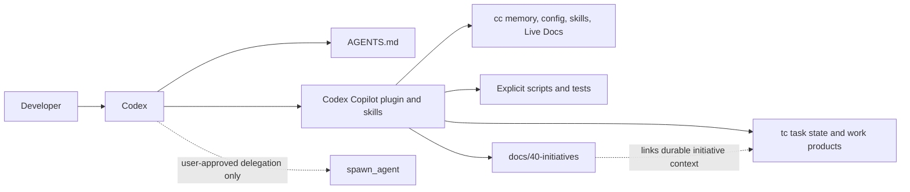

# Architecture

## Goal

Port the `claude-copilot` framework into Codex-native constructs without faking Claude-only features.

## Mapping

| Claude Copilot concept | Codex equivalent |
|------------------------|------------------|
| `CLAUDE.md` | `AGENTS.md` |
| named-agent invocation | specialist playbook applied locally or via `spawn_agent` when explicitly authorized |
| slash commands | documented workflows and reusable skills |
| `.claude/skills/` | `cc` skill discovery bridge to plugin-delivered Codex skills |
| Memory Copilot / Skills Copilot MCP servers | `cc` CLI |
| Task Copilot via `tc` | unchanged |
| knowledge/extensions | dormant capability packs plus project-local plugin activation |
| orchestration worktrees | user-approved `spawn_agent` delegation plus stream validation and explicit git worktree handling |

## Design Choices

### 1. Honest Port, Not Syntax Emulation

Codex does not expose a native named-agent registry like Claude's `@qa`-style agents.

This port therefore uses:

- explicit specialist role definitions
- skill-driven operating procedures
- optional subagent spawning only when user-authorized

### 2. Keep `tc` as the System of Record

The most valuable non-model-specific part of the original framework is its task/work-product discipline. Live tasks, dependencies, assignments, work products, and QA status remain in `tc`.

Formal multi-phase initiative knowledge lives in `docs/40-initiatives/NN-slug/`. Initiative documents hold goals, phase designs, decisions, closure evidence, and retrospectives while linking back to authoritative `tc` execution state.

### 3. Use `cc` For Memory And Skill Discovery

Memory and reusable skill discovery now live behind the Claude Copilot `cc` CLI. Codex Copilot projects link the shared plugin skills into `.claude/skills/codex-copilot` so `cc skill ...` can discover them, and keep durable memory entries under `.claude/memory/entries/`.

### 4. Installable as a Codex Plugin

The plugin bundle gives Codex a native entry point:

- `.codex-plugin/plugin.json`
- marketplace registration
- bundled skills

### 5. Project Overlays Through Packs

The global plugin should stay focused on software creation. Domain capabilities live under `packs/<category>/` and stay dormant until a project activates them through a project-local plugin.

This gives Codex Copilot the same practical inheritance shape as Claude Copilot:

- shared global behavior for every project
- reusable dormant capability source
- project-specific activation and overrides

### 6. Design-Led Decision Instruments

Projects can define two local decision instruments:

- `SOUL.md` for product purpose, taste, anti-patterns, and whether product-facing work belongs in the product
- `docs/01-architecture/12-architecture-guiding-principles.md` for how accepted product direction should be built

`$protocol` reads these before substantial work when they apply. The setup script scaffolds both files by default so design judgment is not hidden in chat history.

### 7. Live Docs For API Correctness

Codex Copilot requires specialists to verify installed third-party package APIs through `cc docs` before planning or coding against them. This mirrors Claude Copilot's Live Docs feature while keeping the tool dependency explicit.

### 8. Explicit QA Gate Substitute

Codex Copilot cannot install Claude runtime lifecycle hooks such as SessionStart,
PreToolUse, or SubagentStop. Instead, QA-required tasks use `tc` metadata,
implementation and test work products, `ARTIFACT:` markers, verdict tokens, and
`scripts/copilot-gate.sh`.

This boundary does not change the design-led product protocol.

### 9. Optional Parity Packs

Claude's `kc`, `cco`, `cw`, `cs`, and `cpa` specialists are useful but not always appropriate for software projects. Codex Copilot ships them as the `business-creative` dormant pack, activated per project.

## Capability Status

### Implemented now

- Codex-native repo instructions
- plugin packaging
- protocol-first entrypoint
- native specialist skills
- machine-readable agent catalog
- routing skill
- `tc` workflow skill
- `cc` CLI bridge for memory and skills
- specialist playbooks
- dormant capability pack convention
- direct software specialist skill names
- design-led project decision-instrument scaffolding
- design-fidelity QA expectations
- Claude 5.13.0 parity manifest with upstream freshness detection
- Live Docs guidance
- QA gate inspection script
- optional business/creative specialist pack
- stream validation utility

### Deliberately deferred

- automatic runtime hook enforcement, unless Codex provides a matching lifecycle surface

### Non-goals

- hidden or autonomous background worker loops
- delegation without explicit user approval
- a second task or memory engine inside this repository

These boundaries are intentional. Hidden workers are not a roadmap item; approved delegation remains explicit and scope-validated.

## System Context

## Ownership Boundaries

| Surface | Owner |
| --- | --- |
| specialist behavior and routing | Codex Copilot plugin skills and catalog |
| live execution state and QA metadata | `tc` |
| memory, config, skill discovery, and Live Docs | `cc` |
| initiative briefs, phases, decisions, and retrospectives | `docs/40-initiatives/` in the consuming project |
| domain-specific optional skills | dormant packs activated by a project |
| runtime lifecycle hooks | host platform; not implemented by this project |
